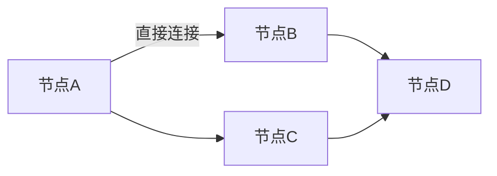
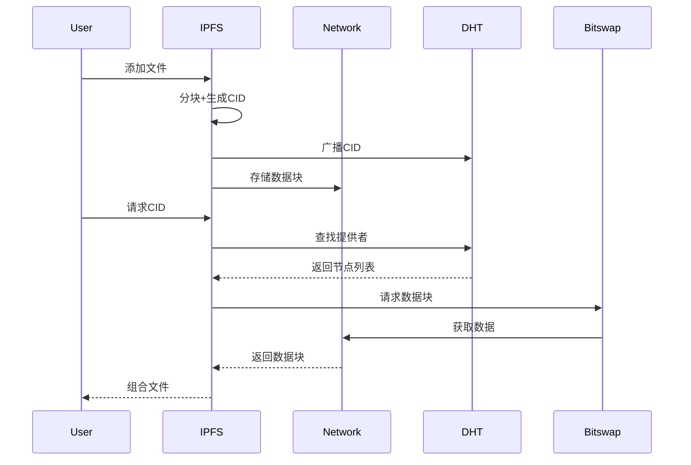
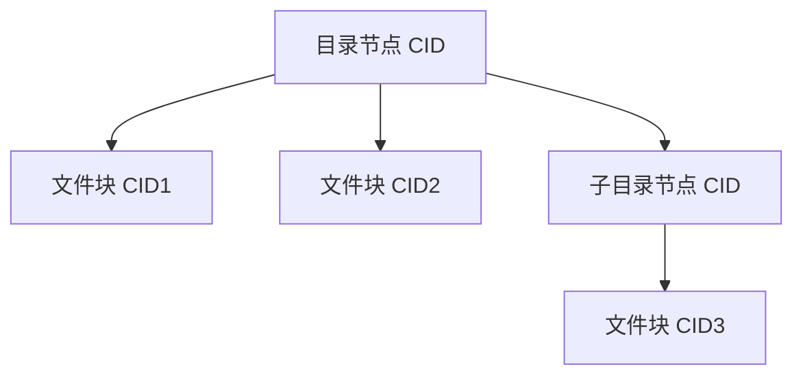
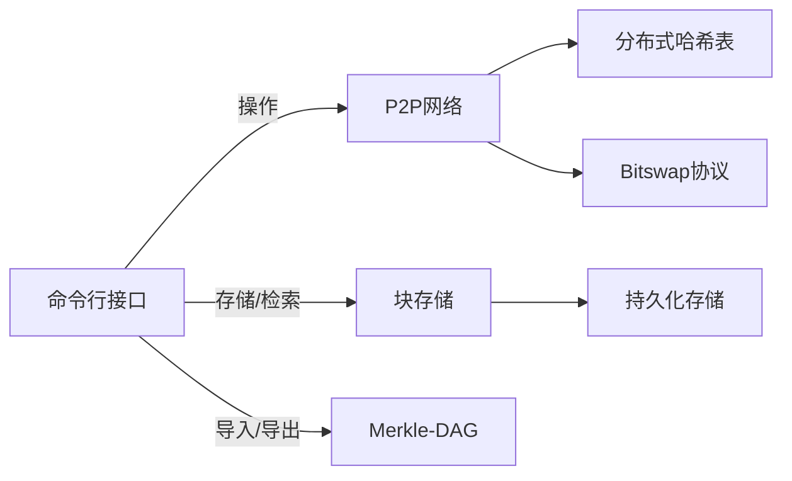
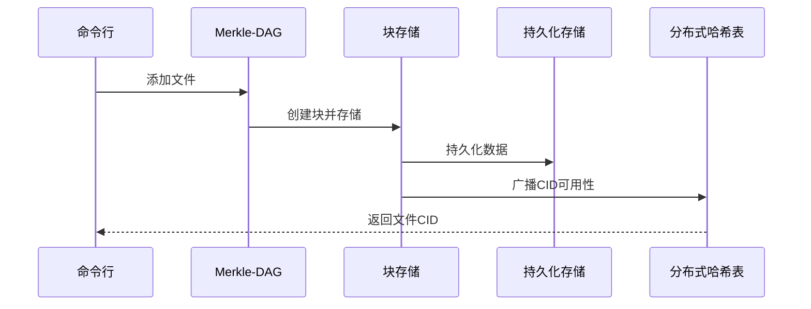
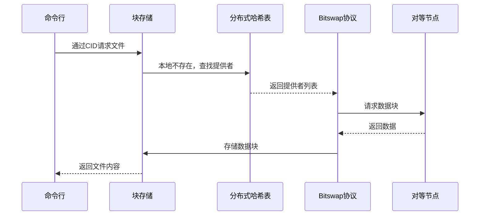

# P2PFS 实验报告

## 1. P2P 与 IPFS 技术背景

### 1.1 P2P 网络技术
点对点（P2P）网络是一种分布式架构，节点之间直接通信共享资源，无需中央服务器。相比客户端-服务器模型，P2P具有：
- **去中心化**：无单点故障
- **可扩展性**：节点越多，网络能力越强
- **资源利用率**：节点贡献带宽和存储



### 1.2 IPFS 架构原理
星际文件系统（IPFS）是典型的P2P文件系统，核心组件包括：
1. **内容寻址**：通过CID唯一标识内容
2. **Merkle-DAG**：文件组织结构
3. **分布式哈希表（DHT）**：内容路由
4. **Bitswap协议**：数据块交换



## 2. 项目原理与架构

### 2.1 核心原理

#### 内容寻址 (Content Addressing)
- 每个数据块通过 multihash 计算生成唯一 CID
- 特点：不可篡改、去重、内容验证
```go
// internal/dag/node.go - 创建节点并生成 CID
func CreateNode(data []byte) (*merkledag.RawNode, cid.Cid) {
    node := merkledag.NewRawNode(data) // 创建原始数据节点
    return node, node.Cid()           // 返回节点及其内容标识符
}
```

#### Merkle-DAG
- 文件表示为有向无环图
- 目录结构通过节点链接实现


### 2.2 系统架构



主要组件说明：
1. **Blockstore**：块存储接口
2. **Datastore**：BBolt 持久化 KV 存储
3. **Merkle-DAG**：文件/目录数据结构
4. **P2P Host**：节点网络管理
5. **Kademlia DHT**：内容路由
6. **Bitswap**：数据块交换协议

## 3. 关键组件与代码实现

### 3.1 持久化存储 (Datastore)

```go
// internal/datastore/bbolt_datastore.go - BBolt 实现
func (b *bboltDatastore) Put(ctx context.Context, bucket string, key []byte, value []byte) error {
    return b.db.Update(func(tx *bbolt.Tx) error {
        bkt, _ := tx.CreateBucketIfNotExists([]byte(bucket))
        return bkt.Put(key, value) // 事务写入 KV
    })
}
```

特点：
- 基于 BBolt 的 ACID 事务存储
- Bucket 组织不同数据类型
- 支持快速随机读写

### 3.2 块存储 (Blockstore)

```go
// internal/blockstore/bbolt_blockstore.go - 块存取
func (b *BboltBlockstore) Put(ctx context.Context, block blockformat.Block) error {
    key := block.Cid().Bytes()     // CID 作为键
    data := block.RawData()        // 原始数据作为值
    return b.ds.Put(ctx, bucketName, key, data)
}
```

功能：
- 基于 CID 的块存取
- 自动处理数据序列化
- 支持存在性检查 (Has 方法)

### 3.3 Bitswap 协议

```go
// internal/bitswap/bitswap.go - 块交换流程
func (b *Bitswap) GetBlock(ctx context.Context, cidKey cid.Cid) (blockformat.Block, error) {
    // 1. 先检查本地存储
    has, _ := b.bs.Has(ctx, cidKey)
    if has {
        return b.bs.Get(ctx, cidKey)
    }
    
    // 2. DHT 查找提供者
    providers, _ := b.dht.FindProviders(ctx, cidKey, 10)
    
    // 3. 向提供者请求数据
    for _, pi := range providers {
        s, _ := b.host.NewStream(ctx, pi.ID, BitswapProtocol)
        // 发送请求并接收响应...
        blk := blockformat.NewBlock(resp.Data)
        _ = b.bs.Put(ctx, blk) // 缓存到本地
        return blk, nil
    }
    return nil, ErrNotFound
}
```

工作流程：
1. 本地存储检查
2. DHT 查找提供者
3. 建立 P2P 连接获取数据
4. 缓存数据到本地

### 3.4 DHT 路由

```go
// internal/routing/kademlia.go - 查找提供者
func (k *KademliaDHT) FindProviders(ctx context.Context, c cid.Cid, max int) ([]peer.AddrInfo, error) {
    ch := k.dht.FindProvidersAsync(ctx, c, max) // 异步查找
    var infos []peer.AddrInfo
    for pi := range ch {  // 收集结果
        infos = append(infos, pi)
    }
    return infos, nil
}
```

功能：
- 异步内容提供者发现
- 支持结果数量限制
- 返回对等节点地址信息

### 3.5 文件导入导出

```go
// internal/dag/importer/importer.go - 文件导入
func ImportFile(ctx context.Context, path string, bs blockstore.Blockstore) (cid.Cid, error) {
    data, _ := os.ReadFile(path)    // 读取文件
    node := merkledag.NewRawNode(data)   // 创建 DAG 节点
    blk := blockformat.NewBlock(node.RawData())
    bs.Put(ctx, blk)                // 存储块
    return node.Cid(), nil          // 返回根 CID
}
```

```go
// internal/exporter/exporter.go - 文件导出
func ExportFile(ctx context.Context, root cid.Cid, bs blockstore.Blockstore, path string) error {
    blk, _ := bs.Get(ctx, root)     // 获取根块
    return os.WriteFile(path, blk.RawData(), 0644) // 写入文件
}
```

## 4. 数据流图

### 4.1 文件添加流程


### 4.2 文件获取流程


## 5. 使用示例

### 5.1 命令行操作
```bash
# 添加文件并获取 CID
./p2pfs add example.txt

# 导出文件内容
./p2pfs cat QmXYZ... > output.txt

# 查看目录结构
./p2pfs ls QmABC...
```

### 5.2 节点操作
```bash
# 启动服务节点
./p2pfs serve --port 8080

# 复制文件到网络
./p2pfs replicate example.txt http://peer:8080
```

## 6. 总结
本项目实现了分布式文件系统的核心功能：
- 内容寻址保证数据完整性
- Merkle-DAG 支持高效文件组织
- P2P 网络实现去中心化存储
- Bitswap 协议优化数据交换
- 持久化存储确保数据可靠性
